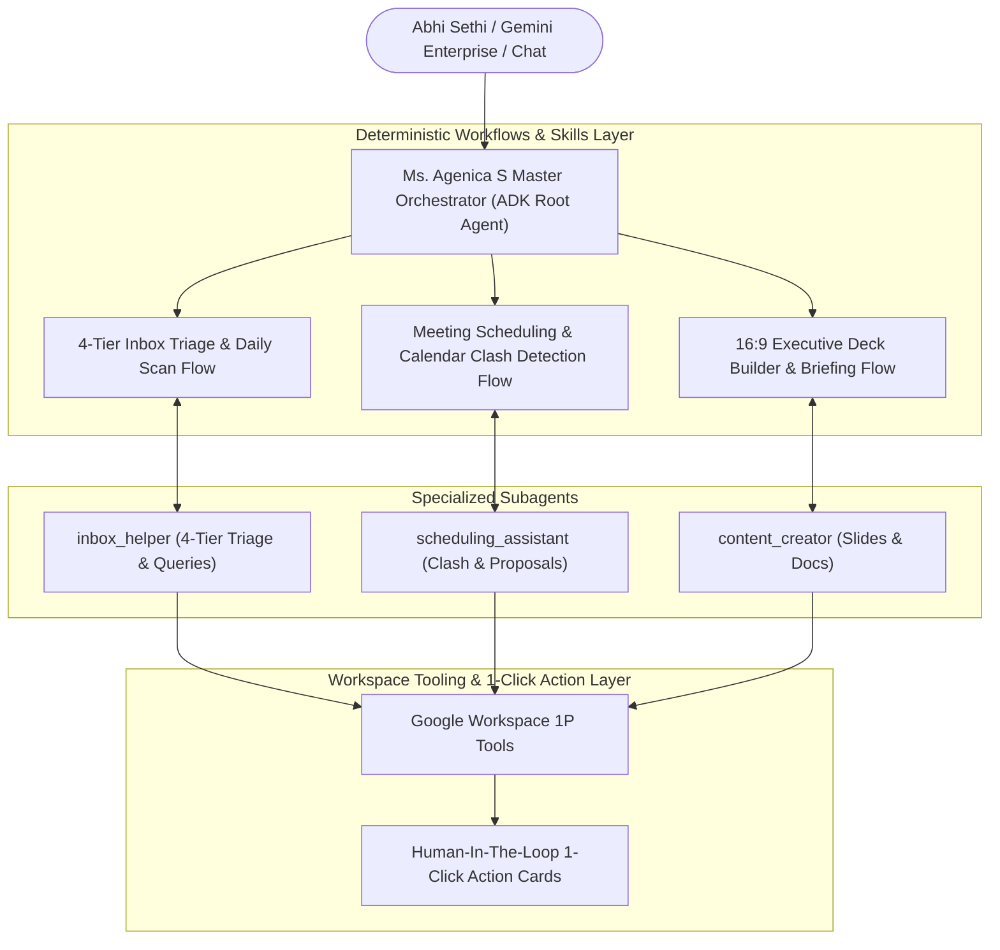

# Ms. Agenica S — Enterprise Executive Assistant (EA) Multi-Agent System

An enterprise-grade **Personal Executive Assistant (EA) Multi-Agent System** for **Abhi Sethi (`aset@google.com`)**, built using the **Google Agent Development Kit (ADK)**, **Deterministic Workflows**, and the **Model Context Protocol (MCP)** for Google Workspace integration (Gmail, Google Calendar, Google Drive, Google Docs, and Google Slides).

---

## 🌟 High-Level Multi-Agent Architecture



---

## 🤖 Subagent Capabilities

### 1. Root EA Orchestrator (`agenica_agent`)
* **Voice & Tone**: Authentic Executive Assistant register — unflappable, discreet, warm and capable, always thinking one step ahead. Avoids robotic filler, emojis, and system-log phrasing.
* **Real-World Date Grounding**: Always calls `get_current_datetime` first to ground all relative dates ("tomorrow", "next Tuesday", "in 3 days") in real-world time.
* **Routing & Synthesis**: Intelligently coordinates subagents and synthesizes multi-step operations into clean, actionable executive summaries.

### 2. Inbox Helper (`inbox_helper`)
* **4-Tier Categorization**:
  1. `Needs action`: Urgent correspondence requiring review and drafted replies.
  2. `Meeting invites`: Inbound meeting requests with calendar clash status.
  3. `Waiting response`: Sent emails awaiting replies from external partners.
  4. `FYI`: Low-priority informational summaries.
* **Ad-hoc Email Queries**: Answers queries like *"Have I had a reply from Flinders on the AI grant?"* or *"List emails needing my attention"*.
* **Privacy Gating**: Deterministically flags and protects confidential topics (HR issues, legal disputes, sensitive compensation).

### 3. Meeting Scheduling Assistant (`scheduling_assistant`)
* **Calendar Clash Detection**: Cross-references Google Calendar bookings and flags scheduling conflicts with existing appointments.
* **Intelligent 3-to-4 Point Agenda**: Formulates structured agendas tailored to meeting topics and attendees.
* **Pre-Booking Proposal Cards**: Applies executive defaults (09:00 - 17:00, Hybrid / Google Meet, 10-min reminders) and generates 1-click Google Calendar links (`[📅 Open & Edit in Google Calendar]`).

### 4. Executive Content & Deck Creator (`content_creator`)
* **16:9 Widescreen Presentation Decks**: Generates structured executive presentations adhering to executive styling (Deep Navy `#002B49`, Royal Blue `#1A73E8`, Vibrant Cyan `#00A3E0`) with bespoke **speaker notes on every single slide**.
* **Google Docs Briefing Memos**: Formats strategic executive summaries, decision points, and talking points in Google Docs.
* **Grounded Review Tags**: Explicitly tags assumptions and verification items:
  * `[NEEDS HUMAN REVIEW: specific detail to check]`
  * `[ASSUMPTION: detail assumed from context]`

---

## 🔒 Mandatory Processing Protocols

| Target Audience | Processing Protocol | Agent Execution Action |
| :--- | :--- | :--- |
| **Internal Googlers (`@google.com`)** | **Full Autonomous Execution** *(with HITL Review)* | Checks calendar availability, sends a Google Chat Human-In-The-Loop approval card to Abhi Sethi, and upon approval, dispatches the email response from `agenica@google.com` and creates the Google Calendar event with Google Meet. |
| **External Partners** *(Flinders, DICT, RCH, Monash, etc.)* | **Draft-Delegate Protocol** | Checks calendar availability, creates a pending Gmail draft in `aset@google.com` signed as **Ms. Agenica S**, and sends an interactive 1-click card with direct link for Abhi Sethi to review & send in Gmail. |

---

## 🛠️ Interactive 1-Click Action Cards (Human-In-The-Loop)

All actions generate interactive 1-click links for confirmation:
* `[📅 Open & Edit in Google Calendar](...)`
* `[✉️ Open & Review Draft in Gmail](...)`
* `[🎨 Open Presentation in Google Slides](...)`
* `[📄 Open Briefing in Google Docs](...)`

---

## 🚀 Quickstart & Local Testing

### 1. Interactive Agent CLI Testing

```bash
# Run a single prompt through the ADK agent
uv run python -m agent.agent "Scan my inbox and summarize what needs my attention"

# Or start interactive REPL
uv run python -m agent.agent --interactive
```

### 2. MCP Server Mode

Add Ms. Agenica S to `~/.gemini/settings.json`:

```json
{
  "mcpServers": {
    "agenica-ea": {
      "command": "python3",
      "args": ["/usr/local/google/home/aset/agenica/mcp_server.py"]
    }
  }
}
```

---

## ☁️ Deployment & Vertex AI Reasoning Engine

Deploy or update on **Google Cloud Vertex AI Agent Engine**:

```bash
adk deploy agent_engine \
  --project ag-test-1310 \
  --region us-central1 \
  --agent_engine_id 1598524430286323712 \
  --display_name "Ms. Agenica S (EA to Abhi Sethi)" \
  agent
```
