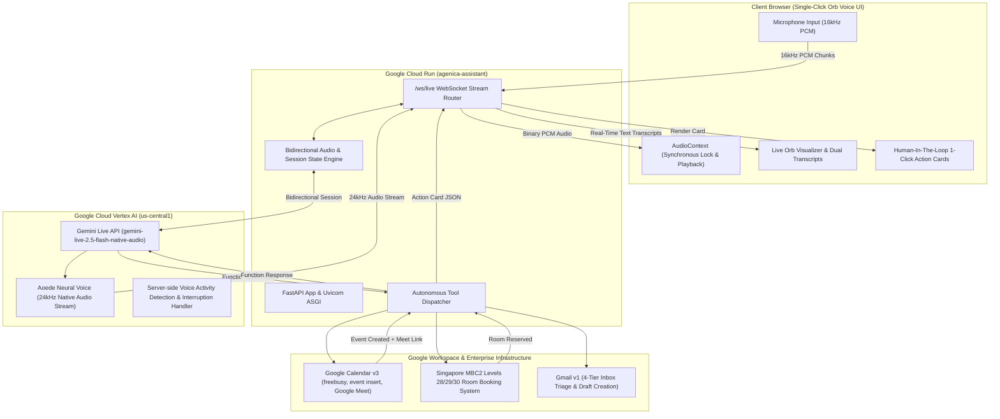

# Agenica — Enterprise Executive Assistant (EA) & Gemini Multimodal Live Voice Portal

[](https://agenica-assistant-537097709161.us-central1.run.app)
[](https://cloud.google.com/vertex-ai)
[](https://python.org)
[](https://fastapi.tiangolo.com)
[](https://workspace.google.com)

**Agenica S** is a production-grade, real-time **Personal Executive Assistant (EA)** and **Multimodal Voice Agent** designed for **Abhi Sethi (`aset@google.com`)**. Powered by Google's **Gemini Multimodal Live API** (`gemini-live-2.5-flash-native-audio`) on Vertex AI, Agenica provides seamless hands-free conversational voice interaction, bidirectional low-latency audio streaming, live speech transcription, real-time Google Workspace operations, and intelligent Singapore office meeting room reservations (Mapletree Business City II - MBC2).

---

## 🌐 Production Cloud Run Deployment

Agenica is deployed live on **Google Cloud Run**:

* **Live Web Portal**: [https://agenica-assistant-537097709161.us-central1.run.app](https://agenica-assistant-537097709161.us-central1.run.app)
* **Direct Service URL**: [https://agenica-assistant-33hogzjfjq-uc.a.run.app](https://agenica-assistant-33hogzjfjq-uc.a.run.app)
* **Live WebSocket Endpoint**: `wss://agenica-assistant-537097709161.us-central1.run.app/ws/live`
* **Healthcheck**: [https://agenica-assistant-537097709161.us-central1.run.app/healthz](https://agenica-assistant-537097709161.us-central1.run.app/healthz)

---

## 🏛️ System Architecture



---

## ✨ Key Features & Capabilities

### 🎙️ 1. Gemini Multimodal Live API Voice Engine
* **Single-Click Instant Activation**: Synchronously initializes browser `AudioContext` and microphone input on the very first tap of the animated Orb—no double clicks or audio dropouts.
* **Low-Latency Bidirectional Audio Streaming**: 
  * Captures browser microphone audio downsampled to **16kHz mono PCM** and streams binary packets over WebSockets.
  * Receives **24kHz native neural audio** generated directly by Gemini's native audio decoder using the warm, professional voice **"Aoede"**.
* **Continuous Multi-Turn Dialogue with Hands-Free VAD**: Server-side Voice Activity Detection (VAD) automatically handles natural conversational pauses, turn switches, and multi-turn exchanges without requiring push-to-talk.
* **Barge-In Interruption Handling**: Real-time cancellation of audio buffer playback whenever you interrupt or begin speaking mid-sentence.
* **Live Dual Speech Transcription**: Displays both real-time user speech recognition and agent spoken response bubbles simultaneously in the chat feed.

### 📅 2. Google Workspace & Calendar Integration
* **Production-Grade `google-api-python-client`**: Uses authentic Google Calendar v3 Discovery APIs (no CLI workarounds or simulations).
* **Automatic Google Meet Injection**: Dynamically generates and attaches conference links (`meet.google.com/...`) for all scheduled meetings.
* **Timezone Anchoring**: Strictly grounds every relative reference ("today", "tomorrow", "this afternoon", "next Monday") in **Asia/Singapore (SGT / UTC+8)**.
* **Free/Busy Availability Queries**: Checks Abhi's primary calendar (`aset@google.com`) using `freebusy.query` to detect clashes before creating appointments.

### 🏢 3. Singapore MBC2 Office Room Booking Engine
* **MBC2 Level 28, 29, and 30 Coverage**: Intelligent room selector with floor, capacity, and resource mapping across Mapletree Business City II (Singapore).
* **Direct Room Reservation**: Reserves room resources directly onto the primary calendar and outputs direct Google Calendar links.
* **Smart Fallbacks**: Suggests available alternatives on adjacent floors if the requested room is busy.

### ✉️ 4. 4-Tier Inbox Triage & Executive Communication
* **Deterministic Triage**: Scans inbox and classifies messages into `Needs Action`, `Meeting Invites`, `Waiting Response`, and `FYI`.
* **Draft-Delegate Protocol**: Prepares professional executive email drafts in Gmail signed by **Ms. Agenica S** for Abhi's one-click review.

---

## 🛠️ Registered Live Tool Declarations

| Tool Name | Purpose | Parameters |
| :--- | :--- | :--- |
| `list_upcoming_events` | Fetches real upcoming appointments from Abhi Sethi's calendar. | `days` |
| `check_calendar_availability` | Checks real-time free/busy intervals on `aset@google.com` to prevent clashes. | `date_str`, `start_time`, `end_time` |
| `check_room_availability` | Checks live availability of MBC2 Singapore meeting & phone rooms (Level 28/29/30). | `date_str`, `start_time`, `end_time`, `floor`, `room_type` |
| `book_singapore_room` | Directly books a verified MBC2 room resource onto Abhi Sethi's calendar. | `date_str`, `start_time`, `end_time`, `floor`, `room_type` |
| `create_calendar_event` | Schedules an event with attendees, description, and Google Meet conferencing. | `summary`, `date_str`, `start_time`, `end_time`, `attendees`, `description`, `add_meet` |

---

## 🚀 Local Development & Quickstart

### Prerequisites
* Python 3.11+
* Google Cloud SDK (`gcloud`) authenticated with access to Vertex AI
* Virtual environment (`venv` or `uv`)

### 1. Installation

```bash
git clone git@github.com:abzzta/agenica.git
cd agenica

# Create virtual environment
python3 -m venv .venv
source .venv/bin/activate

# Install dependencies
pip install -r requirements.txt -r agent/requirements.txt
```

### 2. Run the Live Voice Web Server Locally

```bash
# Set environment variables
export GOOGLE_CLOUD_PROJECT="ag-test-1310"
export GOOGLE_CLOUD_LOCATION="us-central1"
export PRINCIPAL_EMAIL="aset@google.com"
export DEFAULT_TIMEZONE="Asia/Singapore"

# Launch server
python web_server.py
```

Open your browser at **`http://localhost:8080`** and click the animated Orb to start speaking!

### 3. Verify Healthcheck

```bash
curl http://localhost:8080/healthz
```

Expected response:
```json
{
  "status": "ok",
  "service": "Gemini Multimodal Live Voice Portal",
  "model": "gemini-live-2.5-flash-native-audio",
  "voice": "Aoede (Native Audio)",
  "multi_turn": true,
  "tools_enabled": true
}
```

---

## ☁️ Cloud Run Deployment Guide

To deploy updates to Google Cloud Run with Secret Manager Workspace authentication:

```bash
gcloud run deploy agenica-assistant \
  --source . \
  --region us-central1 \
  --project ag-test-1310 \
  --allow-unauthenticated \
  --timeout 3600 \
  --memory 1Gi \
  --cpu 1 \
  --set-secrets="/secrets/token.json=agenica-workspace-credentials:latest,WORKSPACE_CREDENTIALS_JSON=agenica-workspace-credentials:latest" \
  --update-env-vars="WORKSPACE_TOKEN_PATH=/secrets/token.json,GOOGLE_CLOUD_PROJECT=ag-test-1310,GOOGLE_CLOUD_LOCATION=us-central1"
```

### Configuration Options:
* `--set-secrets`: Securely injects `agenica-workspace-credentials` from Google Secret Manager as both a file mount (`/secrets/token.json`) and an environment variable (`WORKSPACE_CREDENTIALS_JSON`).
* `--timeout=3600`: Cloud Run allows up to 3600 seconds (60 minutes) for long-lived WebSocket sessions.
* `--memory=1Gi`: Allocates sufficient memory for high-frequency audio buffer queuing.
* `--allow-unauthenticated`: Enables direct web portal access for authenticated users.

---

## 🔒 Security & Authentication Architecture

1. **User Credentials & Secret Manager**: Secret `agenica-workspace-credentials` contains OAuth tokens for `aset@google.com` to query and manage Google Calendar and Singapore MBC2 room resources directly.
2. **Cloud Run Service Account**: The Cloud Run compute service account (`537097709161-compute@developer.gserviceaccount.com`) has `roles/secretmanager.secretAccessor` and `roles/aiplatform.user` to access Vertex AI Gemini Live API.
3. **Sensitive Email Safeguards**: Executive triage includes deterministic confidential topic masking for privacy-sensitive subjects.

---

## 👥 Persona & Tone

Agenica S speaks with an **unflappable, warm, Australian executive assistant register**:
* Crisp, competent, and discreet.
* Uses direct, natural phrasing ("Right away, Abhi", "I've reserved the room for you on Level 28", "No worries, I'll block that out").
* Avoids robotic filler, excessive emojis, and system log syntax.
